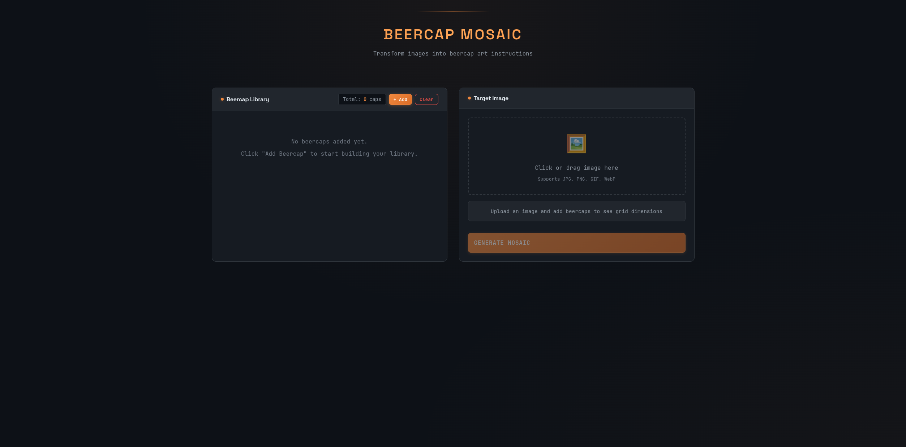

<p align="center">
  
</p>

<h1 align="center">Beercap Mosaic Generator</h1>

<p align="center">
  <strong>Transform any image into beercap art instructions</strong><br>
  A client-side web application that converts images into mosaic patterns using your beercap collection
</p>

<p align="center">
  
  
  
  
</p>

---

## Features

- **Beercap Library Management** — Upload photos of your beercaps, auto-extract their average colors, and track quantities
- **📷 Beercap Scanner** — Photograph multiple caps at once; auto-detect, cluster, and count duplicates
- **Smart Color Matching** — Uses perceptually-weighted color distance for better human-eye matching
- **Global Optimization** — Hungarian algorithm finds the optimal beercap placement across the entire mosaic
- **Multi-threaded WASM** — Rust/WebAssembly with Rayon for blazing fast parallel computation
- **Visual Preview** — See your mosaic before you build it (circular caps, hexagonal or square layout)
- **Reference Grid** — Coded grid (A, B, C...) with legend for easy assembly
- **Export Options** — Download as PNG or CSV for reference
- **Offline Ready** — Everything runs in your browser, no server needed
- **Persistent Storage** — Your beercap library, target image, and settings are saved automatically

## Screenshot



## How It Works

```
┌─────────────┐     ┌─────────────┐     ┌─────────────┐
│  Your       │     │  Target     │     │  Mosaic     │
│  Beercaps   │ ──▶│  Image      │ ──▶│  Grid       │
│  + Qty      │     │             │     │  Output     │
└─────────────┘     └─────────────┘     └─────────────┘
```

### 1. Build Your Beercap Library

**Option A: Add Manually**  
Upload photos of each unique beercap you have. The app automatically extracts the dominant color using center-weighted sampling. Set the quantity you have available for each type.

**Option B: Scan Multiple Caps at Once**  
Use the **📷 Scan** feature to photograph many beercaps spread on a table:

```
┌───────────────────────────────────────────────┐
│  📷 Photo of caps on table                    │
│                                               │
│    ⚪ ⚪ ⚪ ⚪ ⚪                             │
│    ⚪ ⚪ ⚪ ⚪ ⚪                             │
│    ⚪ ⚪ ⚪ ⚪ ⚪                             │
│                                               │
└───────────────────────────────────────────────┘
              ↓ Automatic Detection
┌───────────────────────────────────────────────┐
│  Detected: 15 caps → 4 unique types           │
│                                               │
│  [Cap A ×5] [Cap B ×4] [Cap C ×3] [Cap D ×3]  │
│                                               │
│  [Add All to Library]                         │
└───────────────────────────────────────────────┘
```

The scanner uses:
- **Circle detection** to find individual caps
- **Color histogram matching** to identify duplicates
- **Automatic clustering** to group identical caps and count quantities
- **Color extraction** to get each cap's average color

**Tips for best scanning results:**
- Use a contrasting background (dark caps on light surface, or vice versa)
- Spread caps evenly with some space between them
- Use good, even lighting to avoid shadows
- Keep caps flat (not overlapping)

### 2. Upload Target Image
Choose the image you want to recreate as a beercap mosaic. The app calculates the optimal grid size based on your total available caps and the image's aspect ratio.

### 3. Generate Mosaic
The app uses the **Hungarian Algorithm** (compiled to WebAssembly with multi-threading) to find the globally optimal assignment of beercaps to grid positions. This ensures the best possible color match across the entire image.

### 4. Build Your Art
Use the reference grid with letter codes (A, B, C...) to know exactly which beercap goes where. Export as PNG for visual reference or CSV for a spreadsheet view.

## The Algorithm

Unlike simple greedy approaches that pick the best available cap for each position sequentially (leading to poor matches at the end), this app uses **global optimization**:

```
Cost Matrix: For each grid cell × each beercap slot
┌────────────────────────────────────────┐
│ Cell 1:  Cap A=12.3  Cap B=45.6  ...   │
│ Cell 2:  Cap A=67.8  Cap B=23.1  ...   │
│ ...                                    │
└────────────────────────────────────────┘
           ↓
    Hungarian Algorithm (O(n³))
    [Multi-threaded Rust/WASM]
           ↓
    Optimal Assignment
    (Minimizes total color error)
```

This means a cell might get a slightly worse match so that another cell can get a much better one, improving overall quality.

## Getting Started

### Option 1: Direct File Open
Simply open `index.html` in any modern browser. That's it!

```bash
# Clone or download the project
cd image2beercaps

# Open in browser (Linux)
xdg-open index.html

# Open in browser (macOS)
open index.html

# Open in browser (Windows)
start index.html
```

### Option 2: Development Server (Recommended for Multi-threading)

For full multi-threaded WASM performance, use the included Node.js server which sets the required COOP/COEP headers:

```bash
# Start the development server
node server.js

# Or using npm/yarn
npm run dev
yarn dev

# Then open http://localhost:3000
```

The server displays:
```
🍺 Beercap Mosaic Generator - Development Server
━━━━━━━━━━━━━━━━━━━━━━━━━━━━━━━━━━━━━━━━━━━━━━━━

  Local:   http://localhost:3000

  ✓ Cross-Origin-Opener-Policy: same-origin
  ✓ Cross-Origin-Embedder-Policy: require-corp
  ✓ SharedArrayBuffer enabled (WASM threads ready)
```

## Building WASM (for developers)

If you want to rebuild the WebAssembly module:

### Prerequisites
- Rust (nightly): `rustup install nightly`
- wasm32 target: `rustup target add wasm32-unknown-unknown --toolchain nightly`
- rust-src: `rustup component add rust-src --toolchain nightly`
- wasm-bindgen: `cargo install wasm-bindgen-cli`

### Build Command
```bash
npm run build:wasm
# or
yarn build:wasm
```

This compiles the Rust Hungarian algorithm to multi-threaded WebAssembly.

## Project Structure

```
image2beercaps/
├── index.html          # Main application
├── server.js           # Dev server with COOP/COEP headers
├── _headers            # Static hosting headers (Netlify/Cloudflare)
├── css/
│   └── styles.css      # Dark theme styling
├── js/
│   ├── app.js          # UI logic and event handling
│   ├── colorUtils.js   # Color extraction & matching
│   ├── gridGenerator.js # Mosaic generation (uses WASM)
│   ├── scanner.js      # Beercap photo detection & clustering
│   ├── wasmLoader.js   # WASM module loader with fallback
│   └── storage.js      # LocalStorage persistence
├── wasm/
│   ├── Cargo.toml      # Rust project config
│   ├── src/lib.rs      # Hungarian algorithm in Rust
│   └── pkg/            # Compiled WASM output
├── logo.svg            # Project logo
├── screenshot.png      # App screenshot
└── README.md           # This file
```

## Usage Tips

- **Photo Quality**: Take beercap photos on a neutral background with good lighting
- **Crop Tightly**: Crop your beercap images to show mainly the cap, not surrounding area
- **Quantity Accuracy**: Enter accurate quantities — the algorithm respects your inventory limits
- **Grid Size**: More caps = higher resolution mosaic. ~500 caps works well for recognizable images
- **Color Variety**: A diverse color palette gives better results than many caps of similar colors
- **Layout**: Try hexagonal layout for a more natural, tightly-packed look

## Browser Compatibility

Works in all modern browsers:
- Chrome 79+
- Firefox 79+
- Safari 15.2+
- Edge 79+

**Multi-threading** requires COOP/COEP headers (provided by the dev server or static host config). Without headers, the app falls back to single-threaded WASM, which is still much faster than JavaScript.

## Technical Details

| Feature | Implementation |
|---------|----------------|
| Color Extraction | Canvas API with center-weighted averaging |
| Color Distance | Weighted Euclidean (perceptual) |
| Optimization | Hungarian/Kuhn-Munkres Algorithm |
| Cap Detection | Edge-based circle detection (Sobel + Hough-like) |
| Similarity Clustering | Color histogram comparison (Bhattacharyya) |
| WASM Runtime | Rust + wasm-bindgen |
| Multi-threading | Rayon + wasm-bindgen-rayon |
| Storage | Browser LocalStorage |
| Styling | CSS Custom Properties (variables) |

## Performance

| Grid Size | JavaScript | Single-threaded WASM | Multi-threaded WASM |
|-----------|------------|---------------------|---------------------|
| 20×20     | ~200ms     | ~10ms               | ~5ms                |
| 50×50     | ~15s       | ~500ms              | ~150ms              |
| 100×100   | Minutes    | ~5s                 | ~1.5s               |

## Deploying to Static Hosting

For multi-threading support, configure your hosting to send these headers:

### Netlify / Cloudflare Pages
The included `_headers` file handles this automatically:
```
/*
  Cross-Origin-Opener-Policy: same-origin
  Cross-Origin-Embedder-Policy: require-corp
```

## License

**Non-Commercial Use Only**

This project is free to use and modify for personal and non-commercial purposes. Commercial use is not permitted without explicit permission from the author.

---

<p align="center">
  Made with 🍺 for beercap art enthusiasts
</p>
